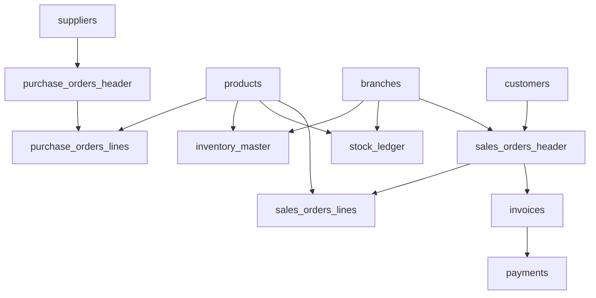

# Heavy Supplier Analytics — Data Model

```mermaid
flowchart TD
    SUP[suppliers] --> POH[purchase_orders_header]
    POH --> POL[purchase_orders_lines]
    PROD[products] --> POL
    PROD --> INV[inventory_master]
    BR[branches] --> INV
    PROD --> SL[stock_ledger]
    BR --> SL
    CUST[customers] --> SOH[sales_orders_header]
    BR --> SOH
    SOH --> SOL[sales_orders_lines]
    PROD --> SOL
    SOH --> INVOICE[invoices]
    INVOICE --> PAY[payments]
```
